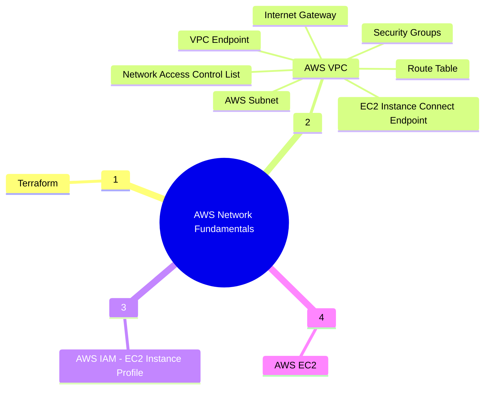

&nbsp;&nbsp;&nbsp;&nbsp;&nbsp;&nbsp;&nbsp;&nbsp;&nbsp;

# Project Scilla: AWS Networking - VPC fundamentals

_This repo creates a basic VPC network in AWS_

## Description

**This repo creates a basic AWS VPC network with two public and two private subnets. A custom Network Access Control List (NACL) for controlling traffic in and out of one or more subnets. Two route tables to control where network traffic is directed. Each subnet in the VPC will be associated with a route table, which controls the routing for the subnet (subnet route table). A subnet is explicitly associated with particular route table. An Internet Gateway establishes outside connectivity for EC2 instances that will be deployed into the VPC. A security groups will be created for the EC2 instances and the VPC endpoints.Two EC2 instances are created in the two subnets. The Ec2 instances can be connected securely using Ec2 instance connect and Session Manager**


### Services Used



## VPC Endpoints required for Session Manager

In order to enable SSH access via Session Manager, the following VPC Endpoints must be created.
- ssm
- ec2messages
- ssmmessages


## VPC Endpoints required for EC2 Instance Connect

In order to enable SSH access via EC2 Instance Connect, create the corresponding endpoints preferable in each of the private subnets for high availability.


## VPC Endpoints required for AWS Public services like S3, KMS

In order to access AWS public services like KMS and S3 VPC Endpoints needs to be created.


## Security Group Configuration

* **VPC Endpoint Security Group**
    -   Inbound Rules
        1) Allow inbound traffic from the VPC on port 443.
    -   Outbound Rules
        2) No outbound rule is required.


* **EC2 Instance Security Group**
    -   Inbound Rules
        1) Allow inbound traffix from EC2 Instance Connect endpoint on port 22.
    -   Outbound Rules
        1) Allow outbound traffic to the Endpoints on port 443.
        2) Add an outbound rule to port 443 to the s3 prefix list.


* **EC2 Instance Connect Security Group**
    -   Inbound Rules
        1) No inbound rule is required.
    -   Outbound Rules
        1) Allow outbound SSH traffic on port 22 to instance security group.


### Getting Started with the GitHub Action CI/CD pipeline 

- This repository is configured to deploy the stack in Development, Staging and Production AWS Accounts. To use the pipeline you need to have
  three AWS Accounts created in an AWS Org under a Management Account (which is the best practice). The Org structure will be as follows:

```
Root
├─ Management
├─ Development
├─ Test
└─ Production
```

- Create KMS Key in each of the AWS Accounts which will be used to encrypt the resources.

- Create an OpenID Connect Identity Provider

- Create an IAM Role for OIDC and use the sample Trust Policy in each of the three AWS accounts

```
{
    "Version": "2008-10-17",
    "Statement": [
        {
            "Effect": "Allow",
            "Principal": {
                "Federated": "arn:aws:iam::<Account Id>:oidc-provider/token.actions.githubusercontent.com"
            },
            "Action": "sts:AssumeRoleWithWebIdentity",
            "Condition": {
                "StringLike": {
                    "token.actions.githubusercontent.com:sub": [
                        "repo:<GitHub User>/<GitHub Repository>:ref:refs/head/main",
                    ]
                }
            }
        }
    ]
}
```

- Create an IAM Policy to allow creation and deletion of resources and attach it to the OIDC Role, using the following sample policy document:

```
{
    "Version": "2012-10-17",
    "Statement": [
        {
            "Effect": "Allow",
            "Action": "*",
            "Resource": "*"
        }
    ]
}
```

### Installing

- The repository directory structure should be as follows:

```
Root
├─ Management
├─ Development
├─ Test
└─ Production
```

- Clone the repository.
- Create a S3 bucket to used a code repository.
- Modify the params/\*.terraform.tfvars files

  - devl.terraform.tfvars -> Parameters for Devl
  - test.terraform.tfvars -> Parameters for Test
  - prod.terraform.tfvars -> Parameters for Prod

- Create the following GitHub repository Secrets:

| Secret Name                   | Secret Value                                                                        |
| ----------------------------- | ----------------------------------------------------------------------------------- |
| AWS_REGION                    | `us-east-1`                                                                         |
| DEVL_AWS_KMS_KEY_ARN          | `arn:aws:kms:<AWS Region>:<Development Account Id>:key/<KMS Key Id in Development>` |
| TEST_AWS_KMS_KEY_ARN          | `arn:aws:kms:<AWS Region>:<Test Account Id>:key/<KMS Key Id in Test>`               |
| PROD_AWS_KMS_KEY_ARN          | `arn:aws:kms:<AWS Region>:<Production Account Id>:key/<KMS Key Id in Production>`   |
| DEVL_AWS_ROLE_ARN             | `arn:aws:iam::<Development Account Id>:role/<OIDC IAM Role Name>`                   |
| TEST_AWS_ROLE_ARN             | `arn:aws:iam::<Test Account Id>:role/<OIDC IAM Role Name>`                          |
| PROD_AWS_ROLE_ARN             | `arn:aws:iam::<Production Account Id>:role/<OIDC IAM Role Name>`                    |
| DEVL_AWS_TF_STATE_BUCKET_NAME | `<Terraform State S3 Bucket in Development>`                                        |
| TEST_AWS_TF_STATE_BUCKET_NAME | `<Terraform State S3 Bucket in Test>`                                               |
| PROD_AWS_TF_STATE_BUCKET_NAME | `<Terraform State S3 Bucket in Production>`                                         |

### Executing the CI/CD Pipeline

- Create Create a feature branch and push the code.
- The CI/CD pipeline will create a build and then will deploy the stack to devlopment.
- Once the Stage and Prod deployment are approved (If you have configured with protection rule ) the stack will be reployed in the respective environments

## Help

:email: Subhamay Bhattacharyya - [subhamay.aws@gmail.com]

## Authors

Contributors names and contact info

Subhamay Bhattacharyya - [subhamay.aws@gmail.com]

## Version History

- 0.1
  - Initial Release

## License

This project is licensed under Subhamay Bhattacharyya. All Rights Reserved.

## Acknowledgments


[AWS Networking Immersion Day Workshop][3]
[Session Manager endpoints][1]
[EC2 Connect Endpoint][2]

[1]: https://docs.aws.amazon.com/systems-manager/latest/userguide/session-manager-prerequisites.html
[2]: https://docs.aws.amazon.com/AWSEC2/latest/UserGuide/create-ec2-instance-connect-endpoints.html
[3]: https://catalog.workshops.aws/networking/en-US/foundational/fundamentals
